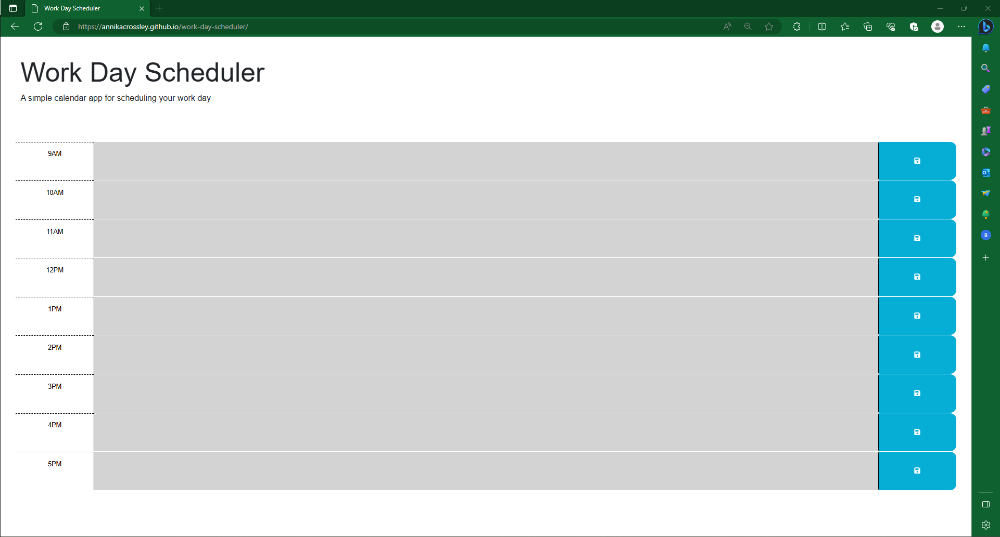

# Work Day Scheduler Starter Code

<ul>
  <li>AS AN employee with a busy schedule</li>
  <li>I WANT to add important events to a daily planner</li>
  <li>SO THAT I can manage my time effectively</li>
</ul>

<ul>
  <li>GIVEN I am using a daily planner to create a schedule</li>
  <li>WHEN I open the planner
  THEN the current day is displayed at the top of the calendar</li>
  <li> WHEN I scroll down
  THEN I am presented with time blocks for standard business hours of 9am to 5pm</li>
  <li> WHEN I view the time blocks for that day
  THEN each time block is color-coded to indicate whether it is in the past, present, or future</li>
   <li>WHEN I click into a time block
  THEN I can enter an event</li>
  <li> WHEN I click the save button for that time block
  THEN the text for that event is saved in local storage</li>
  <li> WHEN I refresh the page
  THEN the saved events persist</li>
</ul>

